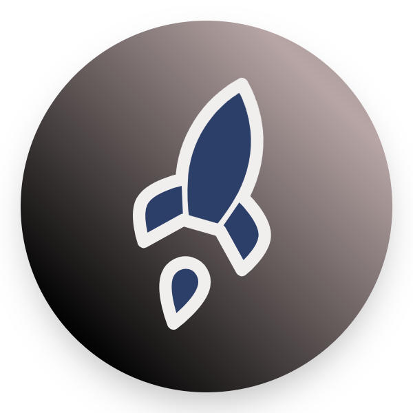

# Project "From C / C++ to Orbit"
--

--
**Stack:**

- For public:
  desc :  présentation de mon apprentissage scolaire et autodidacte.

  - CSS
  - HTML
  - Icons lucide

- c-to-orbit:
  desc : projet en C pour appliquer des formules et des choses du domaine spatial 
  - C
  - stdio.h
